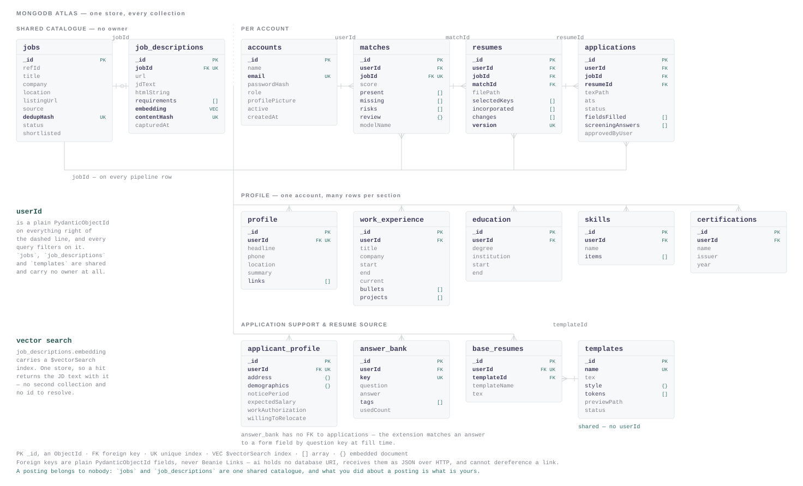
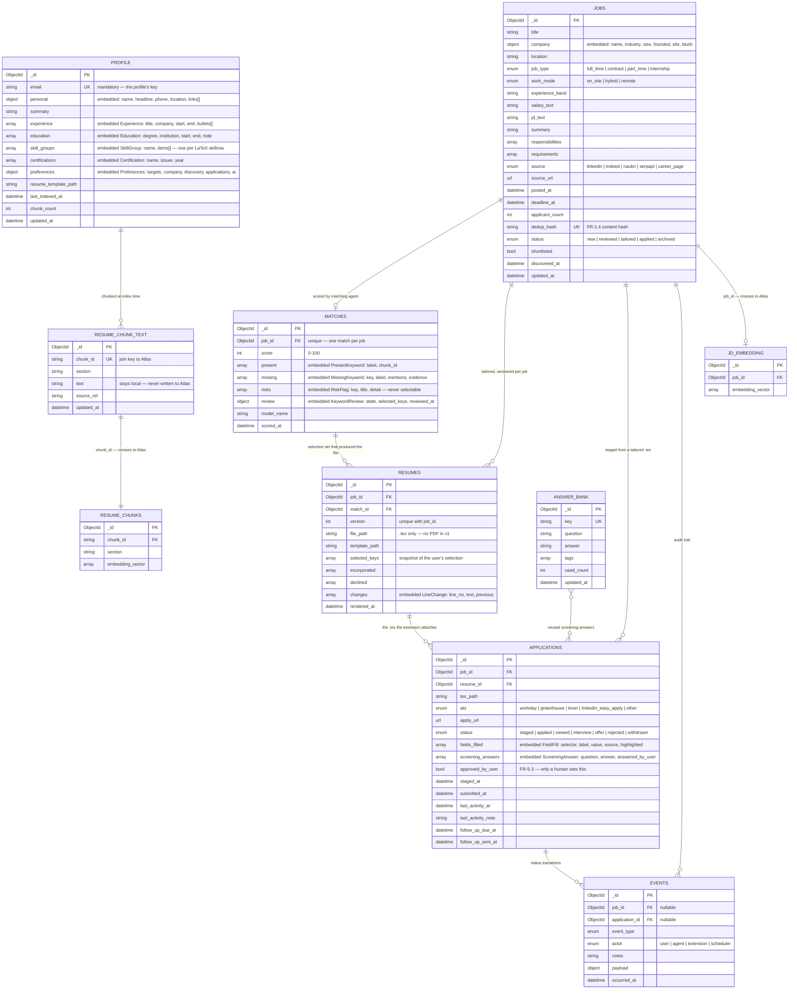

# 06 — Data Model / ER

The Beanie documents behind `server/modules/`, and the two Atlas collections `ai/rag` owns.
Derived from the dashboard screens in [04 — UI/UX](../04-UIUX-Wireframes-User-Flows.md) and the
store split in [03 — Architecture](../03-Architecture-System-Design.md) §3.

**Every document's primary key is MongoDB's own `_id` (`ObjectId`).** Beanie maps it to `id`;
no document declares a surrogate key. Foreign keys are plain `PydanticObjectId` fields, indexed —
not Beanie `Link`s, because `ai` receives these ids as JSON over HTTP and cannot dereference a link.

`job_id` is the only key that crosses the store boundary. There are no cross-store transactions.

---

## Entity relationships

<picture>
  <source media="(prefers-color-scheme: dark)" srcset="er-diagram-dark.svg">
  
</picture>

Every box is keyed on `_id` (an `ObjectId`). The arrows carry the foreign keys. `jobs` is the hub —
`job_id` is denormalized onto every downstream document, which is what lets the two stores stay
unaware of each other. `answer_bank` deliberately has no relationship line: the extension matches an
answer to a form field by question key at fill time, so a foreign key would imply a link the schema
does not have.

Also available as [`er-diagram.png`](er-diagram.png) for slides and tickets. The SVGs are plain text
with presentation attributes only — no stylesheet, no webfonts — so they render anywhere and can be
edited by hand.

Mermaid source, with every field

`JD_EMBEDDING` and `RESUME_CHUNKS` live in **MongoDB Atlas** and belong to `ai/rag/repository.py`.
Everything else is **local MongoDB**, owned by `server`. Neither tier holds the other's connection
string, so the dashed relationships above are resolved in application code by id, never by `$lookup`.

---

## Module ownership

| Collection | Owning module | Store |
|---|---|---|
| `jobs` | `job` | local |
| `matches` | `match` | local |
| `resumes` | `resume` | local |
| `applications`, `answer_bank` | `application` | local |
| `events` | `event` | local |
| `profile`, `resume_chunk_text` | `profile` | local |
| `jd_embedding`, `resume_chunks` | `ai/rag` | Atlas |

A module queries only its own collections. Cross-module reads go through the other module's
`__init__.py` — `match/service.py` calls `job.get_job()`, it never touches `db.jobs`.

---

## Indexes

| Collection | Index | Why |
|---|---|---|
| `jobs` | `dedup_hash` **unique** | FR-1.4 — the same posting from two boards collapses to one row |
| `jobs` | `(status, discovered_at desc)` | the pipeline board reads one column at a time |
| `jobs` | `shortlisted` · `company.name` | Shortlist screen; company filter |
| `jobs` | text on `(title, jd_text)` | the Search screen's keyword field |
| `matches` | `job_id` **unique** | one live match per job; a re-score replaces it |
| `matches` | `review.state` | the "⚠ Pending your review" count |
| `matches` | `score desc` | minimum-match filter |
| `resumes` | `(job_id, version desc)` **unique** | per-job `.tex` versioning |
| `applications` | `job_id` · `(status, staged_at desc)` · `follow_up_due_at` | Applications screen, follow-up sweep |
| `answer_bank` | `key` **unique** | one answer per question key |
| `events` | `(job_id, occurred_at desc)` · `event_type` · `occurred_at desc` | timeline reads |
| `profile` | `email` **unique** | mandatory, and the profile's key |
| `resume_chunk_text` | `chunk_id` **unique** · `section` | the RAG second hop |

---

## Where the guardrails live in the schema

The invariants are not comments here — they are types and constraints the database and Pydantic
enforce.

| Invariant | How the model enforces it |
|---|---|
| **No fabrication** (FR-2.5, NFR-8) | `MATCHES.review.selected_keys` starts empty and a validator rejects a non-empty list while `state` is `pending`. `resume.store_resume()` refuses any `incorporated` keyword outside the user's selection, and `RESUMES.selected_keys` keeps the snapshot that justifies each line in `changes`. |
| **No auto-submit** (FR-5.3, NFR-7) | `ApplicationPreferences.auto_submit` is `Literal[False]` — there is no value to set. `APPLICATIONS.status` reaches `applied` only through a transition carrying `confirmed_by_user`, which is what sets `approved_by_user` and `submitted_at`. |
| **Split store** | `resume_chunk_text.text` is local; Atlas holds `chunk_id` plus the vector. `server` refuses a `mongodb+srv://` URI at connect time. |
| **`.tex` only** (FR-4.4) | `RESUMES.file_path` is the only artifact path. No PDF field exists. |
| **Localhost only** (NFR-4) | `Settings.host` defaults to `127.0.0.1`; CORS admits the Next dev origin and `chrome-extension://` only. |
| **Every step pauses** (FR-7.3) | `MATCHES.review.state` is the keyword interrupt in persisted form; `APPLICATIONS.status = staged` is the submit interrupt. Both leave their waiting state only on a user action. |
| **robots.txt** (FR-1.3) | `DiscoveryPreferences.respect_robots` is `Literal[True]`, which is why the Settings screen renders that toggle disabled. |

---

## Screen → collection map

| Screen | Reads |
|---|---|
| Pipeline board | `jobs` grouped by `status`, `matches.review.state` and staged `applications` for the pending banner |
| Search / Shortlist | `jobs` + `matches` (score, present/missing/risk counts), `jobs.shortlisted` |
| Job details | `jobs` (incl. embedded `company`) + `matches` |
| Keyword Selection ⚠ | `matches.missing` / `.risks`; writes `matches.review` |
| `.tex` Preview | `resumes` (`changes`, `incorporated`, `declined`) over the template |
| Applications | `applications` (staged + submitted), `resumes.file_path` |
| My details | `profile` |
| Settings | `profile.preferences` |

---

## Deliberate absences

- **No `users` collection.** Single-user by design (PRD §4). The Login and Signup screens are UI
  shells with no auth service behind them, and both offer a "skip" link into the dashboard. Adding a
  user table would mean adding tenancy to every query for one person. `email` is mandatory and
  uniquely indexed, and is the profile's key — but it is contact data on the resume, not an identity
  the system authenticates or scopes queries by.
- **No `cover_letters`.** Out of v1 scope (PRD §5).
- **No database-level one-row constraint.** `email` is unique, which prevents a duplicate address
  but not a second profile under a different one. Keeping the collection to a single document is a
  service rule — `create_profile` returns 409 when one already exists — and `get_profile` reads the
  oldest document so repeated reads agree. If a second profile ever needs to be legitimate, that is
  the multi-user change, not an accident.
- **No `settings` collection.** Preferences are a sub-document of `profile`, matching Architecture
  §3.2's `profile { …, preferences, … }`. One user, one preferences blob, always read together.
- **No embedding vector in `matches`.** Architecture §3.2 lists the JD vector next to the score; it
  lives in Atlas instead, because `server` has no Atlas connection by design.
